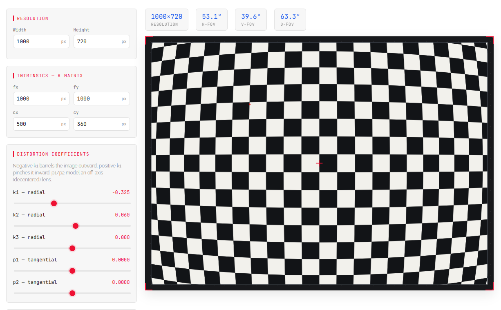

# Camera Model Inspector

A browser-based tool for visualizing a camera's intrinsics (K matrix) and lens distortion coefficients against a synthetic checkerboard target.

**Live:** https://rschwa6308.github.io/Camera-Model-Inspector/

Mostly vibe-coded with the help of Claude Sonnet v5.
